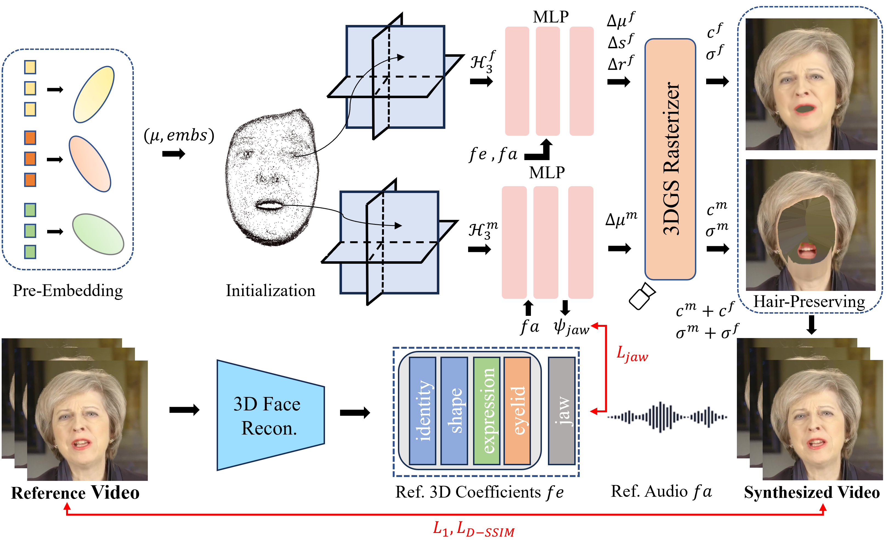

# DEGSTalk: Decomposed Per-Embedding Gaussian Fields for Hair-Preserving Talking Face Synthesis

This is the official repository for our paper **DEGSTalk: Decomposed Per-Embedding Gaussian Fields for Hair-Preserving Talking Face Synthesis**.



## Installation

Tested on Ubuntu 20.04, CUDA 11.8, PyTorch 2.0.1

```
conda env create -n degstalk python=3.9
conda activate degstalk
pip install torch==2.0.1 torchvision==0.15.2 torchaudio==2.0.2 --index-url https://download.pytorch.org/whl/cu118
pip install -r requirements.txt
pip install "git+https://github.com/facebookresearch/pytorch3d.git"
# pip install --no-index --no-cache-dir pytorch3d -f https://dl.fbaipublicfiles.com/pytorch3d/packaging/wheels/py38_cu113_pyt1121/download.html
pip install tensorflow-gpu==2.8.1
```

If encounter installation problem from the `diff-gaussian-rasterization` or `gridencoder`, please refer to [gaussian-splatting](https://github.com/graphdeco-inria/gaussian-splatting) and [torch-ngp](https://github.com/ashawkey/torch-ngp).

### Preparation

- Prepare face-parsing model and  the 3DMM model for head pose estimation.

  ```bash
  bash script/prepare.sh
  ```

- Download 3DMM model from [Basel Face Model 2009](https://faces.dmi.unibas.ch/bfm/main.php?nav=1-1-0&id=details):

  ```bash
  # 1. copy 01_MorphableModel.mat to data_util/face_tracking/3DMM/
  # 2. run following
  cd data_utils/face_tracking
  python convert_BFM.py
  ```

- Prepare the environment for [EasyPortrait](https://github.com/hukenovs/easyportrait):

  ```bash
  # prepare mmcv
  conda activate talking_gaussian
  pip install -U openmim
  mim install mmcv-full==1.7.1
  
  # download model weight
  cd data_utils/easyportrait
  wget "https://n-ws-620xz-pd11.s3pd11.sbercloud.ru/b-ws-620xz-pd11-jux/easyportrait/experiments/models/fpn-fp-512.pth"
  ```

- Prepare the smirk model from [SMIRK](https://github.com/georgeretsi/smirk):

  ```bash
  bash smirk_quick_install.sh
  ```

  


## Usage

### Important Notice

- This code is provided for research purposes only. The author makes no warranties, express or implied, as to the accuracy, completeness, or fitness for a particular purpose of the code. Use this code at your own risk.
- The author explicitly prohibits the use of this code for any malicious or illegal activities. By using this code, you agree to comply with all applicable laws and regulations, and you agree not to use it to harm others or to perform any actions that would be considered unethical or illegal.
- The author will not be responsible for any damages, losses, or issues that arise from the use of this code. 
- Users are encouraged to use this code responsibly and ethically.

### Pre-processing Training Video

* Put training video under `data/<ID>/<ID>.mp4`.

  The video **must be 25FPS, with all frames containing the talking person**. 
  The resolution should be about 512x512, and duration about 1-5 min.

* Run script to process the video.

  ```bash
  python data_utils/process.py data/<ID>/<ID>.mp4
  ```

* Obtain Action Units
  
  Run `FeatureExtraction` in [OpenFace](https://github.com/TadasBaltrusaitis/OpenFace), rename and move the output CSV file to `data/<ID>/au.csv`.

* Generate tooth masks

  ```bash
  export PYTHONPATH=./data_utils/easyportrait 
  python ./data_utils/easyportrait/create_teeth_mask.py ./data/<ID>
  ```

### Audio Pre-process

In our paper, we use DeepSpeech features for evaluation. 

* DeepSpeech

  ```bash
  python data_utils/deepspeech_features/extract_ds_features.py --input data/<name>.wav # saved to data/<name>.npy
  ```

- HuBERT

  Similar to ER-NeRF, HuBERT is also available.

  Specify `--audio_extractor hubert` when training and testing.

  ```
  python data_utils/hubert.py --wav data/<name>.wav # save to data/<name>_hu.npy
  ```

### Train

```bash
# If resources are sufficient, partially parallel is available to speed up the training. See the script.
bash scripts/train_xx.sh data/<ID> output/<project_name> <GPU_ID>
```

### Test

```bash
# saved to output/<project_name>/test/ours_None/renders
python synthesize_fuse.py -S data/<ID> -M output/<project_name> --eval  
```

### Inference with target audio

```bash
python synthesize_fuse.py -S data/<ID> -M output/<project_name> --use_train --audio <preprocessed_audio_feature>.npy
```

## Acknowledgement

This code is developed based on [TalkingGaussian](https://github.com/Fictionarry/TalkingGaussian), [gaussian-splatting](https://github.com/graphdeco-inria/gaussian-splatting) with [simple-knn](https://gitlab.inria.fr/bkerbl/simple-knn), and a modified [diff-gaussian-rasterization](https://github.com/ashawkey/diff-gaussian-rasterization). It also integrates partial code from [RAD-NeRF](https://github.com/ashawkey/RAD-NeRF), [GeneFace](https://github.com/yerfor/GeneFace), [DFRF](https://github.com/sstzal/DFRF), [DFA-NeRF](https://github.com/ShunyuYao/DFA-NeRF/), [AD-NeRF](https://github.com/YudongGuo/AD-NeRF), and [Deep3DFaceRecon_pytorch](https://github.com/sicxu/Deep3DFaceRecon_pytorch). Additionally, the teeth mask is sourced from [EasyPortrait](https://github.com/hukenovs/easyportrait), and expression coefficients are from [Smirk](https://github.com/georgeretsi/smirk). We extend our gratitude to these outstanding projects for their valuable contributions.
